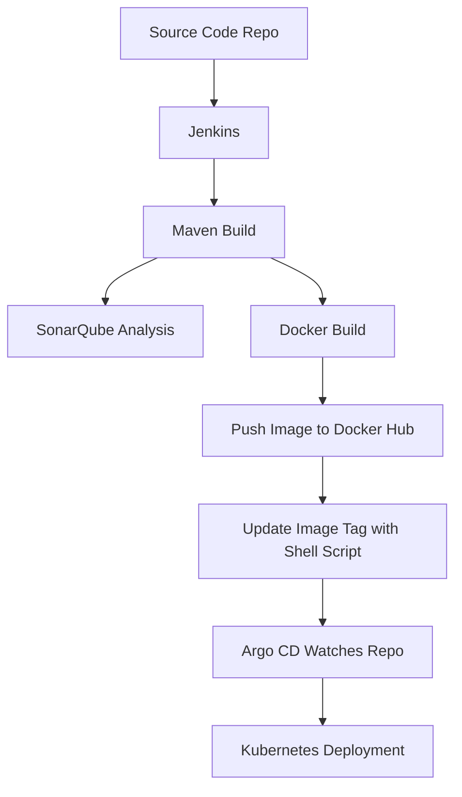

# CI/CD End-to-End Implementation Guide

This documentation explains how to set up a complete CI/CD pipeline using Jenkins, Maven, SonarQube, Docker, Docker Hub, a custom image updater shell script, Argo CD, and Kubernetes. The goal is to automate building, testing, static code analysis, containerization, deployment, and updates.

---

## Table of Contents

1. [Prerequisites](#prerequisites)
2. [Architecture Overview](#architecture-overview)
3. [Step 1: Source Code Management](#step-1-source-code-management)
4. [Step 2: Jenkins Pipeline Setup](#step-2-jenkins-pipeline-setup)
5. [Step 3: Maven Build](#step-3-maven-build)
6. [Step 4: SonarQube Integration](#step-4-sonarqube-integration)
7. [Step 5: Docker Image Build & Push to Docker Hub](#step-5-docker-image-build--push-to-docker-hub)
8. [Step 6: Update Image Tag with Shell Script](#step-6-update-image-tag-with-shell-script)
9. [Step 7: Argo CD Setup](#step-7-argo-cd-setup)
10. [Step 8: Kubernetes Deployment](#step-8-kubernetes-deployment)
11. [Example Jenkins Pipeline](#example-jenkins-pipeline)
12. [References](#references)

---

## Prerequisites

- Source code repository (e.g., GitHub)
- Jenkins server with plugins for Maven, Docker, and Git
- Maven installed on Jenkins agent
- SonarQube server and SonarQube plugin for Jenkins
- Docker installed on Jenkins agent
- Docker Hub account
- Argo CD installed on Kubernetes cluster
- Kubernetes cluster access

---

## Architecture Overview



---

## Step 1: Source Code Management

- Stored application source code in a Git repository (e.g., GitHub).
- Included a Dockerfile and Kubernetes manifests (`deployment.yaml`, `service.yaml`) in the repo.

---

## Step 2: Jenkins Pipeline Setup

- Create a Jenkins pipeline (Declarative or Scripted) linked to my source code repository.
- Configured webhook for trigger on code push.

---

## Step 3: Maven Build

- Jenkins pipeline runs `mvn clean package` to build application.

```bash
mvn clean package
```

---

## Step 4: SonarQube Integration

- Jenkins runs SonarQube scanner after the Maven build:

```bash
mvn sonar:sonar \
    -Dsonar.projectKey=<project_key> \
    -Dsonar.host.url=<sonarqube_url> \
    -Dsonar.login=<token>
```

---

## Step 5: Docker Image Build & Push to Docker Hub

- Build Docker image with application artifact:

```bash
docker build -t <dockerhub_username>/<image_name>:<tag> .
docker push <dockerhub_username>/<image_name>:<tag>
```

- Jenkins Pipeline should use credentials for Docker Hub.

---

## Step 6: Update Image Tag with Shell Script

- Use a shell script to update the image tag in Kubernetes manifest (e.g., `deployment.yaml`):

```bash
#!/bin/bash
FILE="k8s/deployment.yaml"
IMAGE="$1"
TAG="$2"

sed -i "s|image: $IMAGE:.*|image: $IMAGE:$TAG|g" $FILE

git config --global user.email "ci@example.com"
git config --global user.name "CI Bot"
git add $FILE
git commit -m "Update image tag to $TAG"
git push origin main
```

- Placed script in repo (e.g., `scripts/update-image.sh`) and call from Jenkins.

---

## Step 7: Argo CD Setup

- Install Argo CD in your Kubernetes cluster.
- Register your Git repo and application manifest with Argo CD.
- Argo CD will monitor the repo for changes to manifests (`deployment.yaml`).

---

## Step 8: Kubernetes Deployment

- When image tag is updated in the manifest and pushed, Argo CD syncs and deploys the new version to Kubernetes.

---

## Example Jenkins Pipeline

```groovy
pipeline {
    agent any
    environment {
        DOCKER_IMAGE = "dockerhub_username/app"
        DOCKER_TAG = "${BUILD_NUMBER}"
    }
    stages {
        stage('Checkout') {
            steps { checkout scm }
        }
        stage('Build') {
            steps { sh 'mvn clean package' }
        }
        stage('SonarQube Analysis') {
            steps {
                withSonarQubeEnv('SonarQubeServer') {
                    sh 'mvn sonar:sonar'
                }
            }
        }
        stage('Docker Build & Push') {
            steps {
                sh """
                docker build -t $DOCKER_IMAGE:$DOCKER_TAG .
                echo $DOCKERHUB_TOKEN | docker login -u $DOCKERHUB_USER --password-stdin
                docker push $DOCKER_IMAGE:$DOCKER_TAG
                """
            }
        }
        stage('Update K8s Image Tag') {
            steps {
                sh """
                chmod +x scripts/update-image.sh
                scripts/update-image.sh $DOCKER_IMAGE $DOCKER_TAG
                """
            }
        }
    }
}
```

---

## References

- [Jenkins Documentation](https://www.jenkins.io/doc/)
- [Maven Documentation](https://maven.apache.org/)
- [SonarQube Documentation](https://docs.sonarqube.org/)
- [Docker Hub](https://hub.docker.com/)
- [Argo CD Documentation](https://argo-cd.readthedocs.io/)
- [Kubernetes Documentation](https://kubernetes.io/docs/)

---

## Notes

- Secure credentials using Jenkins credentials manager.
- Use `kubectl` or Argo CD UI/CLI to monitor deployments.
- For rollback, use Git and Argo CD sync.

---

**This document can be committed to your repository at `docs/CI-CD-End-to-End-Implementation.md`.**
